# Trip Explorer

Trip Explorer is a simple application that enables users to select points of interest (POIs) from a curated list on a map and export them as a
KML (Keyhole Markup Language). This file can be imported into an offline map such as [Organic Maps](https://organicmaps.app/) in case you are travelling to
a remote area with no phone coverage.

In addition to selecting POIs, the application allows users to sort and categorize them, making it easy to plan trips in advance using each category as a
daily itinerary.

Selected POIs are saved locally, and the application does not require a frontend or backend server, running entirely in the user's browser.

### Technology

Trip explorer is built using Typescript, React and Vite.

The map is powered by Leaflet, and GeoJSON data is sourced from multiple providers, including:

* [BP Australia](https://www.bp.com/en_au/australia/home/who-we-are/find-your-nearest-bp.html)
* [Campermate](https://campermate.com/)
* [Explore Parks WA](https://exploreparks.dbca.wa.gov.au/)
* [FuelWatch](https://www.fuelwatch.wa.gov.au/)
* [OpenStreetMap](https://www.openstreetmap.org/).
* [Western Australia Visitor Centre](https://www.wavisitorcentre.com.au/)
* [Western Australia website](https://www.westernaustralia.com/)
* [Wiki Camps](https://wikicamps.com.au/)

### Online demo
A live demo of the application is available at [https://jricardo27.github.io/online_trip_explorer/](https://jricardo27.github.io/online_trip_explorer/).

While the application can run on mobile devices, it is not yet optimized for mobile use.

### Interface

#### Base layer
The interface is straightforward, with a layer control in the top-right corner allowing users to switch between different base layers:

|                                                                                                |                                                                               |
|------------------------------------------------------------------------------------------------|-------------------------------------------------------------------------------|
| **OpenStreet Map** 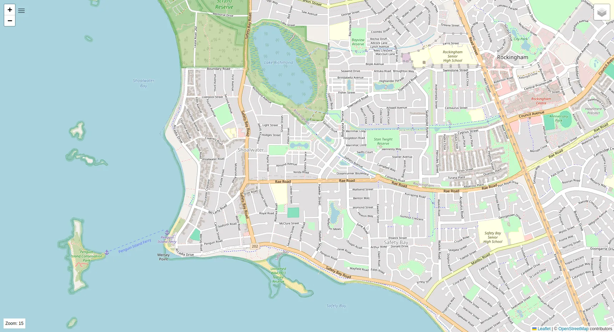                          | **CyclOSM (slow to load)** 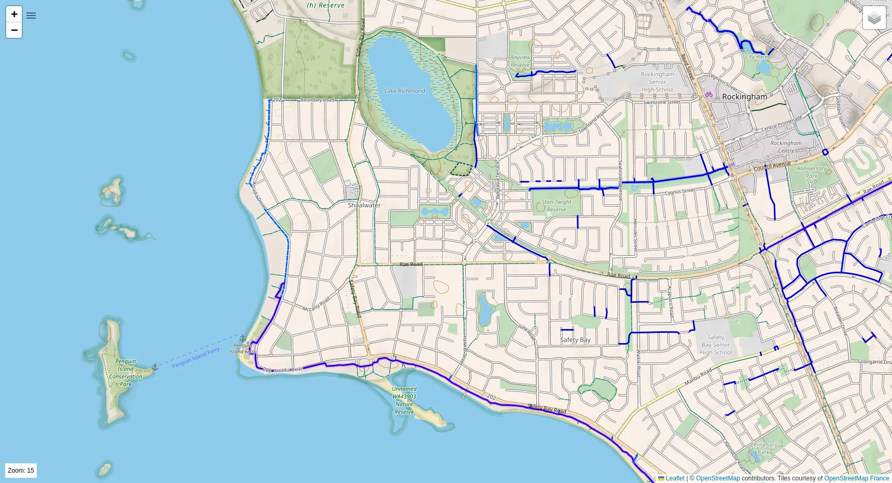              |
| **Esri World Imagery** 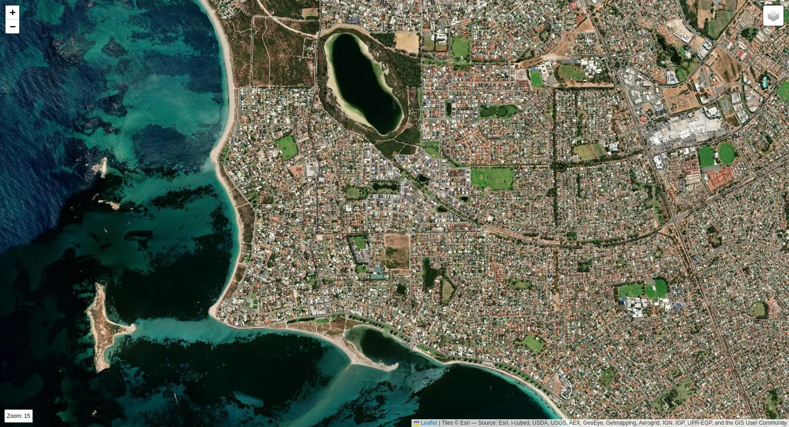                 | **Esri World Street Map** 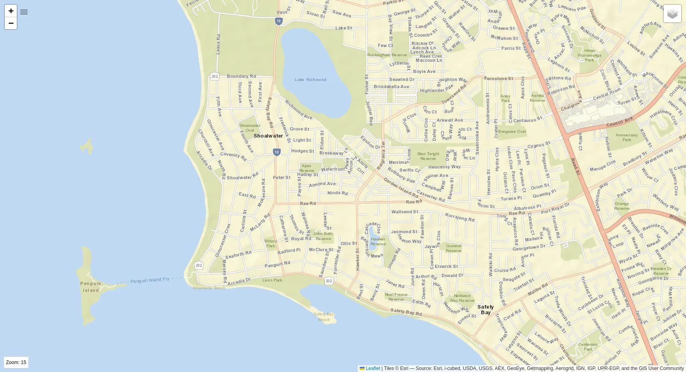 |
| **Esri World Topographic Map** 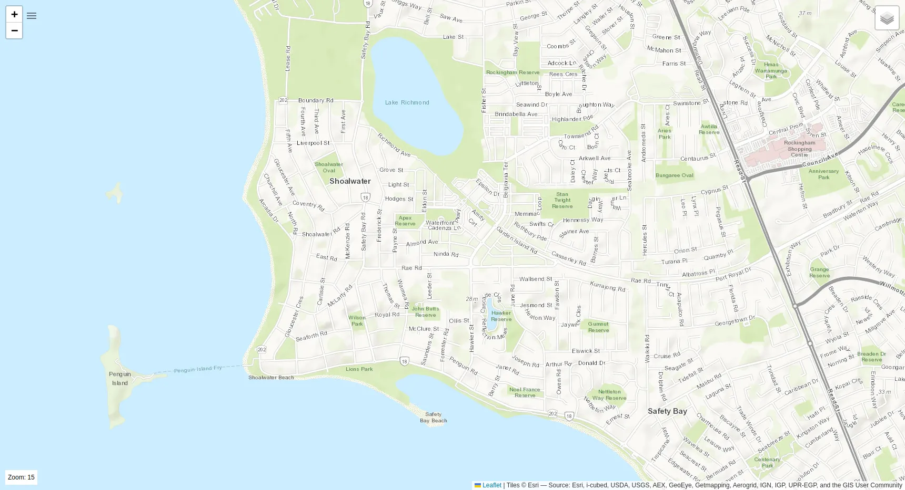 |                                                                               |

#### Points Of Interest (POIs)
On the same layer control, users can select one or multiple data sources, such as:

National Parks in Western Australia
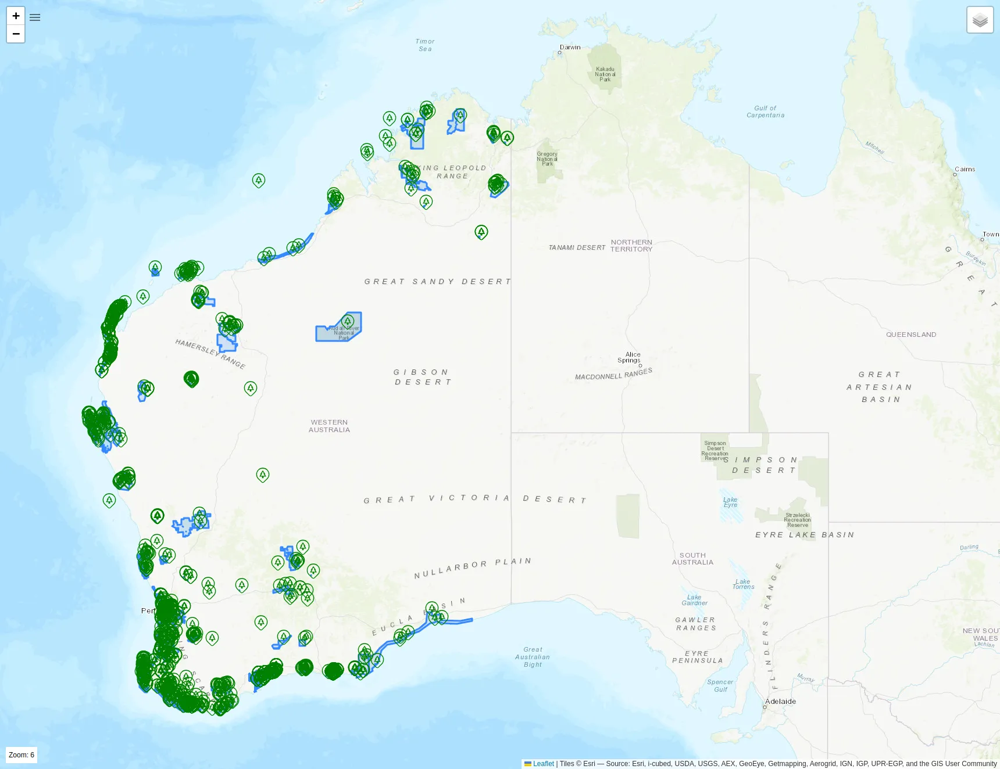

#### Saved POIs
POIs can be saved by right-clicking on them or adding them from their popup menu. Users can also right-click on any point on the map to save it as a POI with
a custom name.

| 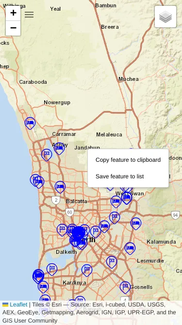 | 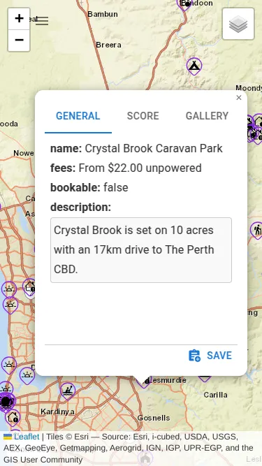 |
|-------------------------------------------------|-----------------------------------|

The saved POIs can be accessed by opening the hamburger menu in the top-left corner of the map, next to the zoom controls.

| 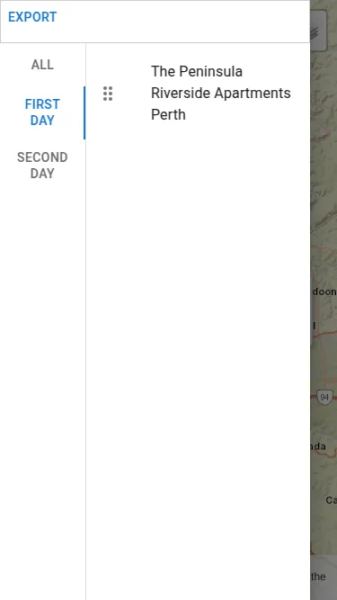 | 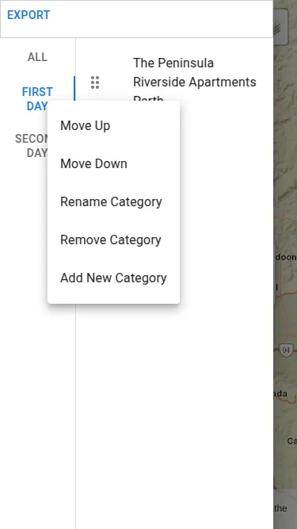 |
|-----------------------------------------------|-----------------------------------------------|

By default, only the *ALL* category is present, but users can add custom categories, such as *FIRST DAY* and *SECOND DAY*, by right-clicking on the left side
of the drawer. Categories can be rearranged, deleted, or renamed, except for the *ALL* category.

POI information can be viewed by clicking on them, and the *Add/Edit Notes* button toggles the notes editor.

| 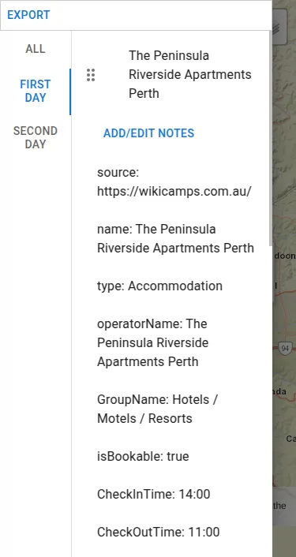 | 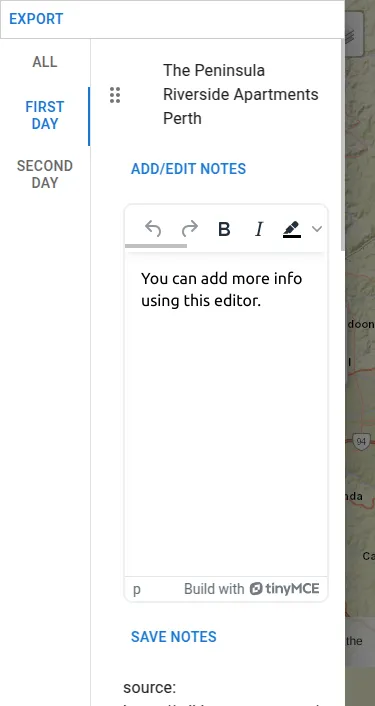  |
|------------------------------------------------|-----------------------------------------------------|

#### Exporting

Saved POIs can be exported as a GeoJSON or KML file, with a zip file automatically downloaded when the desired option is selected.

**Note:** When exporting to KML, polygons are converted to MultiLineStrings due to a limitation in the Organic Maps app that does not support polygons,
the converted MultiLineStrings are shown as tracks.

Google Earth does not have this limitation, and in the future, it may be possible to select whether to export a KML including polygons or not.

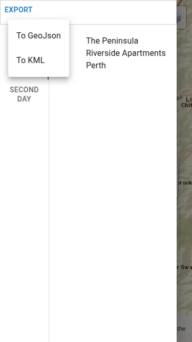
